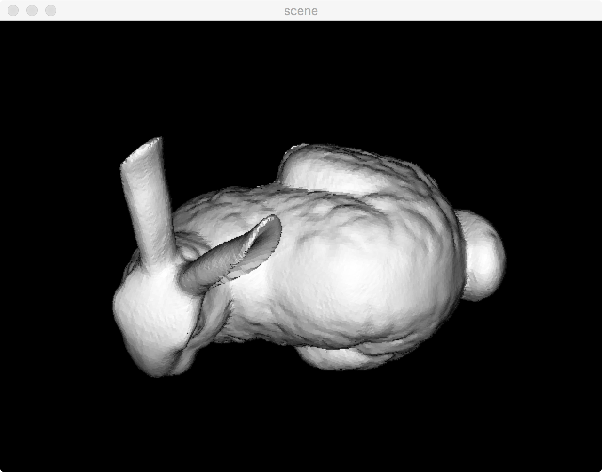
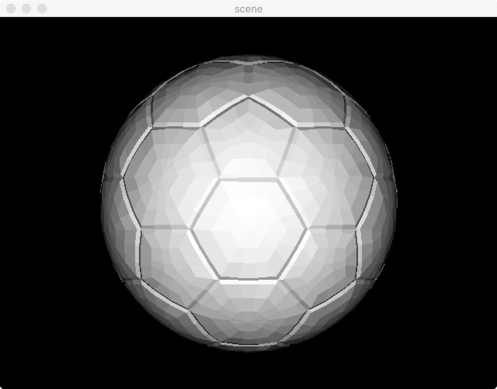

# Interval Scan Lines

DrinkingCoder

## Build

Platform: Macbook Pro, Mid 2014

OS:	Max OS High Sierra

CMake: Version 2.8

Compiler: llvm 9.0.0, c++11

3rdLibrary:

​	Eigen3 (contained in the source folder)

​	jsoncpp(contained in the source folder)

​	OpenCV(version 2.4.12)

Build Command:

```shell
cd PROJECT_DIR
mkdir build
cd build
cmake ..
make
```

Then the executable file will be generated in {$PROJECT_DIR}/bin.

## User Guide

1. A configuration file called "config.json" is presented in path "${PROJECT_DIR}/bin". You can change the file name in "config.json" to change the object that need to be displayed.

   I've implement both scan line zbuffer and interval scan line zbuffer algorithm.

   example:

   ```json
   {
       "obj": "bunny.obj",
       "zBuffer": false,
       "intervalZBuffer": true
   }
   ```

   ​

2. Operations:

   ```
   "q", "w", "e" - object yaw, pitch and roll
   "Q", "W", "E" - corresponding inverse rotation
   "z", "x", "c" - rotate light direction
   "Z", "X", "C" - corresponding inverse rotation
   Other key - Quit
   ```

# Algorithm Introduction

## Scan Line Z-Buffer:

"*In computer graphics, z-buffering, also known as depth buffering, is the management of image depth coordinates in 3D graphics, usually done in hardware, sometimes in software.*"

​								\-Wikipedia \<Z-buffering\>

Z-buffering is a famous solution to the visibility problem, which aims to decide which elements in rendered scene are visible and which are hidden. As we know z-buffer algorithm is simple but not efficient enough in both memory and time, so we use scan line z-buffer to improve its memory efficiency.

Original z-buffer algorithm use a depth buffer to determine the visibility of elements. However, there is a notable property that lines in different height are not related, so we can manipulate the elements line by line, which called scan line z-buffer.  We'll use a line to scan the scene from top to bottom. Polygons projected from faces will be represented by a covering line when it falls onto the scan line, so we just solve a problem of covering line instead. Pseudocode is presented below:

```
for y = 0 to height
	update edge-pairs, polygons information
	initialize zbuffer to max
	for edge-pair in edge-pairs
		for x = edge-pair.left to edge-pair.right
			if zbuffer[x] > edge-pair.z[x]
				idxbuffer[x] = edge-pair.id
				zbuffer[x] = edge-pair.z[x]
			endif
		endfor
	endfor
	fill color according to idxbuffer
endfor
```


## Interval Scan Line Z-Buffer:

​	There is a strong assumption from Scan Line Z-Buffer to Interval Scan Line Z-Buffer for simplication:

​	*Faces will not walk through any other faces[1]* .

​	When we sort the end points of edge pairs ascend, visibility of polygons will not change between the discrete points if faces in 3D space obey the rule of [1]. We can just compare the depth of two polygons at the end point, and fill the index buffer between end point with the index of poygon which is visible at the end point. Pseudocode is presented below:

```
for y = 0 to height
	update edge-pairs, polygons information
	initialize zbuffer to max
	
	sorted-endpoints = end points in edge-pairs
	sort(sorted-endpoints)
	polygons-stack.resize(0)
	for x = 0 to sorted-endpoints.size()
		idx = sorted-endpoints[x].polygon-idx
		if idx in polygons-stack
			polygons-stack.erase(idx)
			continue
		elseif
			polygons-stack.push_back(idx)
		endif
		
		z = max
		for idx in polygons-stack
			if z > polygons[idx].depth
				z = polygons[idx]
				idxbuffer[x] = idx
			endif
		endfor
	endfor
	fill color according to idxbuffer
endfor
```

# Basic Class And Library

## 3rdparty libraries:

- Eigen3 - Basic BLAS operation: 
  - Dot product, cross product for vector
  - Matrix multiplication
  - Translation between rotation vector and rotation matrix
- jsoncpp - configuration solver
- OpenCV - image displayer:
  - change the pixels in specified position
  - show image
  - listen to the keyboard

## Classes:

- class Object:
  - Load object data from file
  - Normalize the object to a proper object coordinate for convenience rendering
  - Generate normals for faces
- class IntervalScanLineZBuffer
  - Transform objects from world coordinate to camera coordinate and project the object to the image coordinate with orthogonal projection.
  - Implement Scan Line Z-Buffer algorithm
  - Implement Interval Scan Line Z-Buffer algorithm
- main.cpp
  - Parse configuration from *config.json*
  - listen to the keyboard and perform cooresponding operation

# Data Structure

```c++
struct Vertex {
    Vector3 pt;
    Vector3 normal;
    real_type ill;
};
// 3D vertex loaded from obj file

struct Face {
    std::vector<int> vIdx, nIdx;
    Vector3 normal;
    real_type ill;
};
// 3D face loaded from obj file
```

```c++
struct Edge {
    real_type x, dx, dy;
    int idx; //polygon
};
// Edge structure for polygons

struct EdgePair {
    Edge left, right;
    real_type zl, dzx, dzy;
    void Increment() {
        left.x += left.dx;
        right.x += right.dx;
        zl += dzx*left.dx + dzy;
    }
};
// Each scan line will go through two edges, which we'll use EdgePair to represent them

struct IntervalActiveEdge {
    int idx;
    real_type x;
};
// End point structure for Interval Scan Line

struct Plane {
    Vector3 normal;
    real_type d;
};
// Plane for the polygon

struct Polygon {
    Plane plane;
    int idx;
    float ill;
    real_type dy;
    bool flag = false;
};
// Polygons that transform from faces
```

# Algorithm Details

## Loading Object

​	As the structure of ".obj" file is so complicated, especially for faces constituted by more than three vertices, so I referenced the method introduced by "Learning OpenGL".

```c++
void Object::LoadObject(const string & fileName) {
    ifstream fin(fileName);
    if (!fin.is_open()) {
        cout << "Failed to open file: " << fileName << endl;
        return;
    }
    int fcount = 0, vcount = 0;

    string type;
    while (fin >> type) {
        if (type == "v") {
            Vector3 v;
            real_type x, y, z;
            fin >> x >> y >> z;
            v << x, y, z;
            vertices.push_back(v*10);
            vcount++;
        } else if (type == "vt") {
            float vt;
            fin >> vt >> vt;    //we don't need texture
        } else if (type == "vn") {
            Vector3 vn;
            real_type x, y, z;
            fin >> x >> y >> z;
            vn << x, y, z;
            normals.push_back(vn);//in fact, we don't use these normals
        } else if (type == "f") {
            fcount++;
            Face f;
            int vIdx, nIdx, tmp;
            while (1) {	//read indices of vertex recursively
                char c = fin.get();
                if (c == ' ') {
                    continue;
                } else if (c == '\n' || c == EOF || c == '\r') {
                    break;
                } else {
                    fin.putback(c);
                }

                fin >> vIdx;
                char splitter = fin.get();
                nIdx = 0;

                if (splitter == '/') {
                    splitter = fin.get();
                    if (splitter == '/') {
                        fin >> nIdx;
                    } else {
                        fin.putback(splitter);
                        fin >> tmp; //we don't need texture
                        splitter = fin.get();
                        if (splitter == '/') {
                            fin >> nIdx;
                        } else {
                            fin.putback(splitter);
                        }
                    }
                } else {
                    fin.putback(splitter);
                }

                f.vIdx.push_back(vIdx - 1);
            }

            this->GenerateNormalForFace(f);
          //use cross product to generate normal
            faces.push_back(f);
        }
    }

    fin.close();
    cout << "faces count = " << fcount << endl;
    cout << "vertex count = " << vcount << endl;
    pose = Matrix4::Identity();
}
```

## Normalizing Object

​	As the scale and translation of objects varies, we just normalize to a proper object coordinate to render for convenience.

```c++
void Object::Normalize() {
    real_type maxy, miny, maxz, minz;
    real_type maxx = maxy = maxz = -numeric_limits<real_type>::max();
    real_type minx = miny = minz = numeric_limits<real_type>::max();
    for (auto vItr = vertices.begin(); vItr != vertices.end(); vItr++) {
        if (maxx < (*vItr)[0]) {
            maxx = (*vItr)[0];
        }
        if (maxy < (*vItr)[1]) {
            maxy = (*vItr)[1];
        }
        if (maxz < (*vItr)[2]) {
            maxz = (*vItr)[2];
        }
        if (minx > (*vItr)[0]) {
            minx = (*vItr)[0];
        }
        if (miny > (*vItr)[1]) {
            miny = (*vItr)[1];
        }
        if (minz > (*vItr)[2]) {
            minz = (*vItr)[2];
        }
    }
  // we assume the height of the image is 480. let's figure out a proper scale
    real_type scale = 480/max(max((maxx - minx), (maxy - miny)), (maxz - minz)) * 0.8;
    Vector3 center;
  // find the center of the object and move it to zero
    center << (maxx + minx)/2, (maxy + miny)/2, (maxz + minz)/2;
    for (auto vItr = vertices.begin(); vItr != vertices.end(); vItr++) {
        *vItr = (*vItr - center) * scale;
    }

  // make a rotation
    pose.block(0, 0, 3, 3) = Matrix3(Eigen::AngleAxisf(M_PI , Vector3::UnitX()));
}
```

## Scan Line Z-Buffer

```c++
void IntervalScanLineZBuffer::RawScanLineDraw();
// code is so long and the pseudocode is presented before, so we eliminate the bulk of c++ implementation. If you want to know the details, please go to see the code.
```

## Interval Scan Line Z-Buffer

```c++
void IntervalScanLineZBuffer::Draw();
// the same as mentioned above
```

# Experiment Result

## bunny




## teapot


## soccer




Experiment result showed above is generated by different object and key board operation combinations(object and light rotations), and all rendering result is generated by Interval Scan Line Z-Buffer Algorithm.